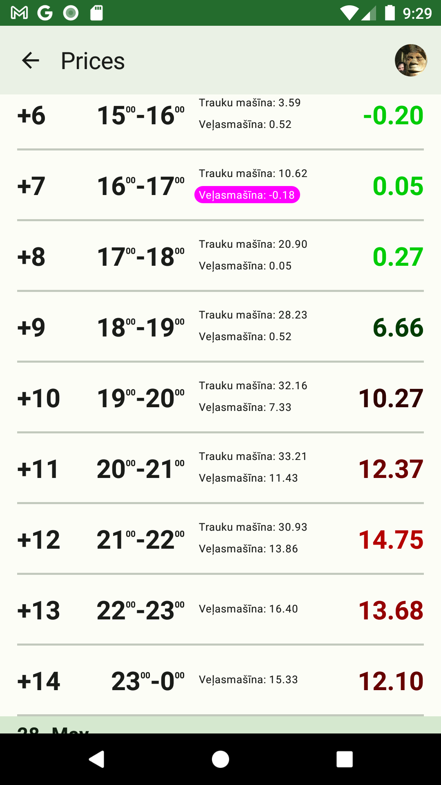
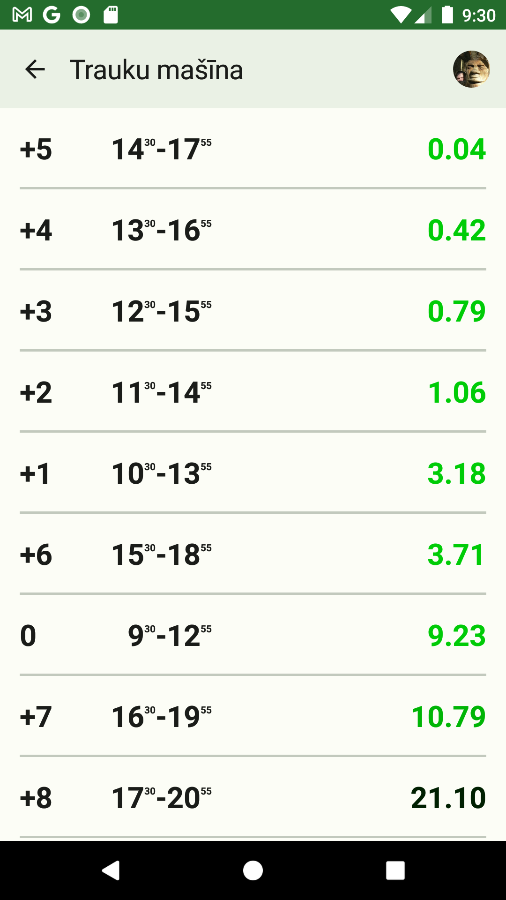

# laiks-android

Some household appliances like laundry washers and dishwashers have delayed start functionality. Usualy you set number of hours when it should start or complete the program. 
It's  a little confusing to guess the number if you want to do the job in, let's say, at around five in the morning, and now is 20:30 in the evening.

So why I wrote this simple Android app. You set number of hours and see the exact time when it will be.

## Installation

I'm not publishing this app in Google Play Store just because they will charge me for account, forcing me to earn some money by showing adds on the screen. It' a overkill for such a small utility.

And possibly this app as my first learning project is not robust and fully tested to make it available for general public.

## Usage

Just presss "+" and "-"

## Little extra

Possibly your have grid connection with hourly rates and you have access to electricity prices for the next day. Then you can calculate the best time for power hungry appliances to run. This app can do that too. A syou can see, the cost of one dishwasher run can differ by more than hundred times depending on hour!

